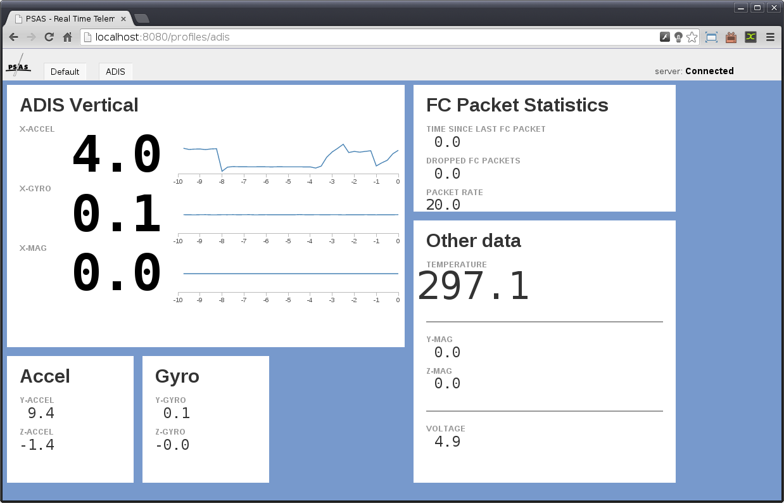

# PSAS Telemetry

# Documentation

Documentation for the telemetry server is on
[read the docs](http://psas-telemetry-server.readthedocs.org/).

## Installing

See [quickstart](http://psas-telemetry-server.readthedocs.org/en/latest/quickstart.html)
for more detail.

Make sure you have python and pip:

    $ sudo apt-get install python2.7 python-pip virtualenvwrapper

To build the javascript you need [coffeescript](http://coffeescript.org/)

    $ sudo apt-get install nodejs npm

Install globablly, since you might want this for other projects.

    $ sudo npm install -g coffee-script

Now you can build the js:

    $ make build

For the server, create a python environment to run in:

    $ mkvirtualenv psas-telemetry

Install python dependencies:

    (psas-telemetry)$ pip install -r requirements.txt

## Running

Start the telemetry server.  If you changed some scripts, don't forget to
rerun `make build`.

    (psas-telemetry)$ ./telemetry.py

## Usage

Once the rocket is sending data and the backend server is running, simply
navigate to [http://localhost:8080](http://localhost:8080) to start seeing data.
