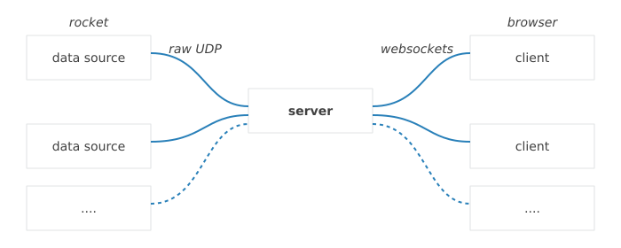

=====================
PSAS Telemetry Server
=====================

.. sidebar:: Contents

    .. toctree::
        :maxdepth: 1

        quickstart
        feeds

`Portland State Aerospace Society <http://psas.pdx.edu/>`_  PSAS is a student
aerospace engineering project at Portland State University. They are building
ultra-low-cost, open source rockets that feature some of the most sophisticated
amateur rocket avionics systems out there today.

One major challenge is how to display various data in real time [#fRT]_. So
we've created a *real time telemetry viewer*.

Overview
========

Incoming data is centered around the idea of :ref:`feeds`. The code consists of
a python sever that listens to feeds and sends data to a front end web app.

This way telemetry can be viewed from any device with a modern browser (phones,
tablets, laptops, etc.).

    The telemetry server is the glue between raw data feeds and end users
    viewing the data

The front end is designed to be as configurable as possible, with different
views stored in yaml files. This allows different users view only the data they
are interested in and in a way that suits their device.

--------------------------------------------------------------------------------

.. rubric:: Footnotes:

.. [#fRT] Or at least human reaction time suitable real time. Tens of milliseconds is okay.

